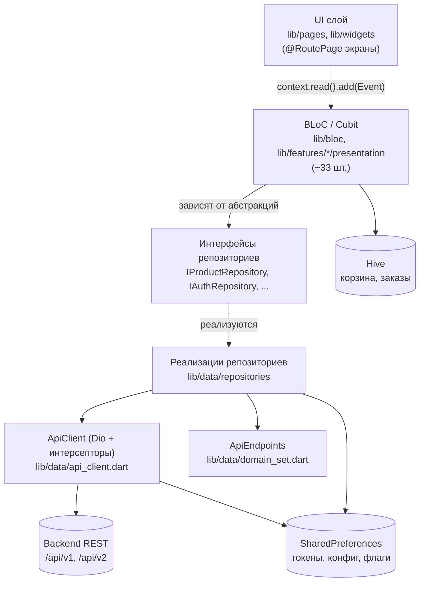
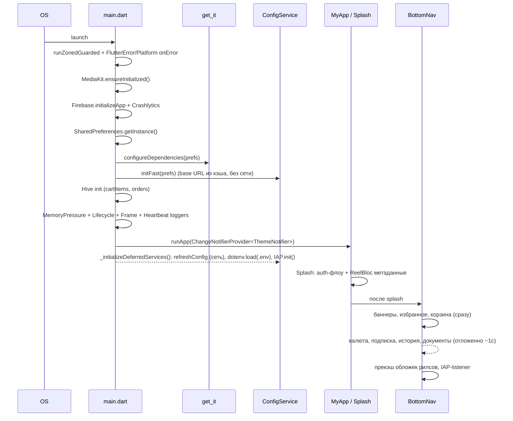
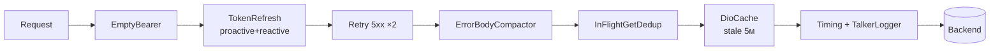
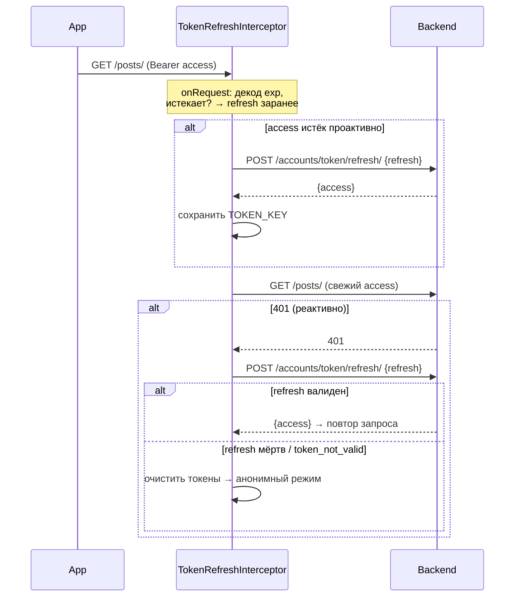

# Архитектура

## Слои

Приложение построено по слоистой архитектуре с инверсией зависимостей (DIP): UI зависит от
BLoC, BLoC — от **интерфейсов** репозиториев, репозитории — от `ApiClient`.

**Принципы :**
- SOLID + Clean Code; запрещены helper-методы (статические утилиты) — только extension-методы,
  сервисы и use-case классы.
- Навигация только `auto_route` (`@RoutePage`, guards).
- Immutable-модели на `Equatable` + `copyWith`.
- Единая обработка ошибок: sealed `AppException` + `ErrorHandler` + `GlobalErrorHandler`.

## Dependency Injection (get_it)

`lib/core/di/injection.dart` → `configureDependencies(SharedPreferences)`. Регистрируются
**только репозитории и сервисы** (паттерн `registerLazySingleton`). **BLoC НЕ регистрируются в
get_it** — они создаются в `MultiBlocProvider` в `lib/app/app.dart` и получают репозитории через
`getIt<...>()`.

Группы регистрации:
- **Репозитории** (~21): `IProductRepository`, `IUserRepository`, `IAuthRepository`,
  `ICategoryRepository`, `IChatRepository`, `ICommentRepository`, `IFavoriteRepository`,
  `IMarketRepository`, `IPmtRepository`, `IReviewRepository`, `IReelRepository`,
  `ISubscriptionRepository`, `IImageRepository`, `ISettingsRepository`, `IAdWalletRepository`,
  `IIapRepository`, `IStoreReviewRepository`, `ISupportRepository`, `IAdminRequestRepository`,
  `IBlockRepository`, `IReportRepository`.
- **Сервисы**: `CartStorageService`, `IPlayerFactory`, `IVideoPreBufferService`,
  `IReelMetadataCache`, `IConnectivityConfig`, `DeviceRemoteDataSource`,
  `NotificationsRemoteDataSource`, `PushNotificationService`, `ChatResolver`.
- **Feature-репозитории**: `PromotionRepository`, `ReferralRepository`.

## Поток запуска (startup)

**Ключевое разделение:** Splash грузит **только** аутентификацию и метаданные рилсов; всё
остальное — в `bottom_nav.dart`, чтобы не блокировать первый кадр.

## Сетевой слой

### Динамический base URL
URL backend не захардкожен (`lib/services/config_service.dart`):
- Источник: `https://elibay-api.vercel.app/config.json` (поле `start_point`).
- Fallback: `https://optombai.com`. Кэш в `SharedPreferences` (`start_point`, `app_config`).
- `getApiUrl()` → `<start_point>/api/v1`; v2 — подмена `/api/v1` → `/api/v2`.

### Реестр эндпоинтов
Все URL — в `ApiEndpoints` (`lib/data/domain_set.dart`). Новый эндпоинт добавляется **только сюда**.

### Цепочка интерсепторов Dio (`lib/data/api_client.dart`, singleton `ApiClient.I`)

| Интерсептор | Назначение |
|---|---|
| `EmptyBearerInterceptor` | отбрасывает запрос с пустым токеном (анонимный доступ без сети) |
| `TokenRefreshInterceptor` | проактивный + реактивный refresh JWT |
| `RetryInterceptor` | до 2 повторов на 5xx (экспон. задержка; multipart пропускается) |
| `ErrorBodyCompactor` | усечение больших/HTML тел ошибок |
| `InFlightGetDedupInterceptor` | схлопывает одинаковые параллельные GET |
| `DioCacheInterceptor` | кэш GET (MemCacheStore 50 МБ, stale 5 мин; 401/403 не кэшируются) |
| `TimingInterceptor` / `TalkerDioLogger` | тайминги и логи |

## Аутентификация и JWT

- Токены в `SharedPreferences`: `TOKEN_KEY` (access), `REFRESH_TOKEN_KEY` (refresh),
  `REGISTER_KEY` (флаг регистрации).
- При мёртвой сессии токены очищаются, приложение продолжает работать анонимно (эндпоинты
  доступны без авторизации). См. [troubleshooting.md](troubleshooting.md#мёртвая-сессия).
- `AuthGuard` (`lib/app/router/app_router.dart`) редиректит на `SignInRoute` для защищённых
  экранов.

## Карта каталогов

См. раздел «Структура каталогов» в [корневом README](../README.md).
