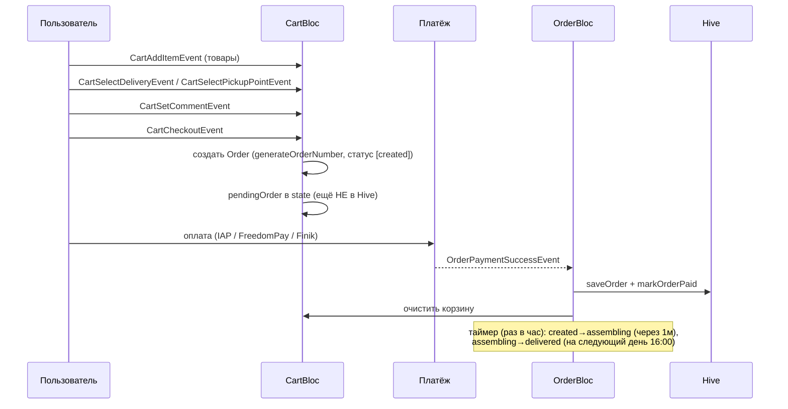
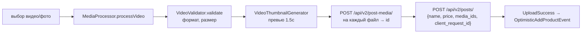

# Корзина и заказы

Корзина и заказы хранятся **локально** в Hive (не на сервере). Заказ создаётся при checkout,
помечается оплаченным после успешного платежа, статусы продвигаются по таймеру.

## Хранилище (Hive)

| Бокс | typeId | Модель | Файл |
|---|---|---|---|
| `cartItems` | 10 | `CartItem` | `lib/data/models/cart/cart_item_model.dart` |
| `orders` | 14 | `Order` | `lib/data/models/cart/order_model.dart` |
| — | 11 | `OrderStatusType` (enum) | `order_status_model.dart` |
| — | 12 | `OrderStatus` | `order_status_model.dart` |
| — | 13 | `DeliveryType` (enum) | `delivery_type.dart` |

Адаптеры регистрируются в `main.dart` → `_initializeHive()`.

### CartItem
`id` (local UUID), `productId`, `productNumber?`, `productName`, `productImage?`, `price`,
`quantity`, `ownerName?`, `countryName?`, `countryFlag?`, `addedAt`. Вычисляемое:
`totalPrice = price * quantity`.

### Order
`id` (`EB{YYYY}{MM}{4 digits}`), `items[]`, `subtotal`, `deliveryType`, `deliveryCost`, `total`,
`pickupPointId?`, `comment?`, `createdAt`, `paidAt?`, `statusHistory[]`, `isPaid`, `userName?`,
`userPhone?`. Вычисляемые: `currentStatus`, `totalItems`.

### DeliveryType
- `pickup` — бесплатно (до пункта выдачи).
- `courier` — фиксированная стоимость (см. модель).

### OrderStatus
`type` ∈ `created | assembling | delivered`, `timestamp`, `message`. Фабрики `OrderStatus.created()`
и т.д.

## Поток checkout

## Сервис и BLoC

- `CartStorageService` (`lib/services/cart_storage_service.dart`): `getCartItems`, `addToCart`,
  `updateQuantity`, `removeFromCart`, `clearCart`; заказы: `getOrders`, `saveOrder`, `markOrderPaid`,
  `checkAndUpdateOrderStatuses`.
- `CartBloc` (`CartState`): `items`, `deliveryType`, `selectedPickupPoint`, `comment`,
  `pendingOrder`; вычисляемые `subtotal/deliveryCost/total/itemCount`.
- `OrderBloc` (`OrderState`): `orders[]`, фильтры `paidOrders`/`pendingOrders`, `getOrderById`.

> ⚠️ `OrdersScreen` использует **scoped** `BlocProvider<ProductBloc>` (а не глобальный), чтобы
> home-fetch не отменял запрос экрана. См. [troubleshooting.md](../troubleshooting.md#orders-screen-был-пуст).

## Создание товара (upload v2, media-first)

Связанный поток для продавца (`UploadCubit` + `MediaProcessor`):

- `client_request_id` (UUID) — идемпотентность: retry с тем же id вернёт существующий пост.
- Таймауты загрузки: stall 25с, send 15м; до 3 ретраев с backoff.
- Откат: `DELETE /api/v2/post-media/{id}/`.
- Классы: `VideoValidator`, `VideoThumbnailGenerator`, `MediaProcessor` (`lib/services/media/`).

Детали контрактов: [api-contracts.md](../api-contracts.md#товары-posts).
