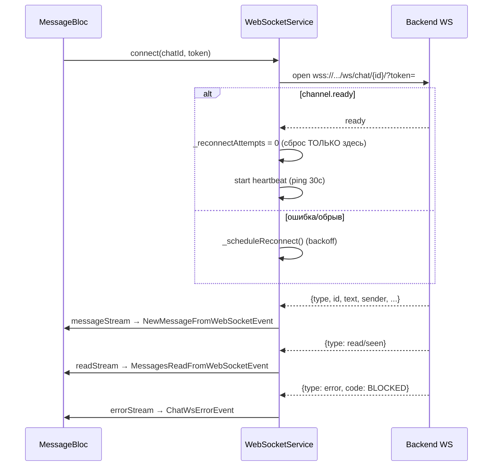

# Чат (WebSocket)

Один-на-один и групповые чаты. REST используется для истории и **отправки**; WebSocket — только для
**приёма** входящих сообщений и read-receipt'ов.

## Компоненты

| Класс | Файл | Роль |
|---|---|---|
| `WebSocketService` | `lib/data/services/websocket_service.dart` | соединение, reconnect, 3 stream'а (message/error/read) |
| `ChatBloc` | `lib/bloc/chat_bloc/` | список чатов: создание, мут, перевод, пагинация |
| `MessageBloc` | `lib/bloc/message_bloc/` | сообщения одного чата + интеграция WS |
| `ChatResolver` | `lib/services/chat/chat_resolver.dart` | резолв чата по id (кэш → пагинация) для deep-link |
| модели | `lib/data/models/chat/` | `ChatModel`, `MessageModel`, `ChatUserModel`, `LinkedPostModel` |

## Соединение

```
wss://<host>/ws/chat/{chatId}/?token=<access>
```



## Reconnect-логика (важно: «reconnect storm fix»)

- Экспоненциальный backoff: `(3 << attempts).clamp(3, 48)` секунд, максимум **5** попыток.
- **Бюджет попыток сбрасывается только на `channel.ready`**, а не на `connect()`. Иначе при
  нестабильной сети каждая неудачная попытка считалась бы «успехом» и лимит не срабатывал → шторм
  переподключений и заспамленный `crash_log.txt` ошибками `Failed host lookup`.
- Гейт по сети: офлайн → ждём событие восстановления (`connectivity_plus`), не тратим попытки.
- Heartbeat ping каждые 30с — отсекает «мертвые» соединения.

См. также [troubleshooting.md](troubleshooting.md#websocket-reconnect-storm).

## Маршрутизация payload

| `type` | Куда | Условие |
|---|---|---|
| `text/image/video/file` + непустой `id` | `messageStream` → `Message` | обычное сообщение |
| содержит `read` или `== seen` | `readStream` → `ChatReadReceipt` | прочтение |
| `error` | `errorStream` → `ChatWsError(code, detail)` | например `BLOCKED` |
| пустой `id` (system) | drop | служебные события |

## Состояния BLoC

- **ChatBloc** `ChatState`: `chats[]` (сортировка по `updatedAt desc`), `chatListModel` (next/prev),
  `isLoading`, `isLoadingPaginate`, `lastMutedUserName`, `isTranslating`.
- **MessageBloc** `MessageState`: `messages[]` (upsert по id — для re-broadcast с флипом `is_read`),
  `isSending`, `isWebSocketConnected`, `currentChatId`,
  `transientError`/`transientErrorTick` (one-shot WS-ошибки типа BLOCKED, отдельно от `errors`).
  - `upsertMessage()` — update если есть, иначе add.
  - `markRead(ids)` — пустой список = отметить все.

## ChatResolver (deep-link)

`resolveById({chatId, token, cached})`: сначала ищет в `cached`, затем постранично тянет `/chats/`
до нахождения или конца пагинации. Используется при навигации из push (`message → chat`).

## Эндпоинты
См. [api-contracts.md](api-contracts.md#чат).
