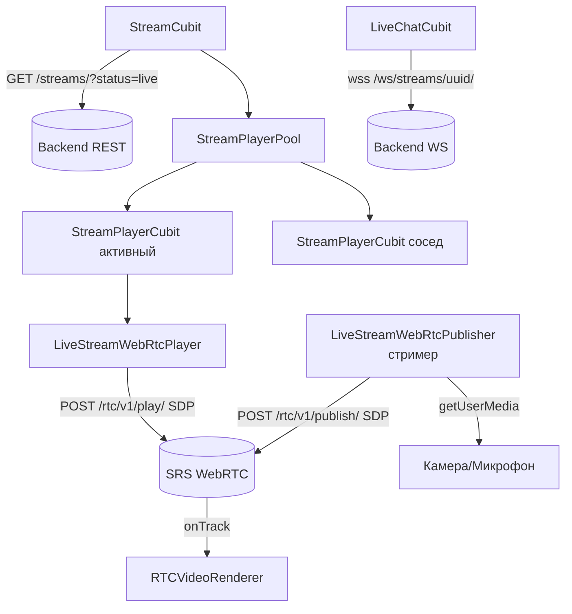

# Live-стримы (WebRTC)

Прямые трансляции через WebRTC поверх **SRS** (Simple Realtime Server). Лента стримов в стиле
рилсов, с пулом плееров и отдельным лайв-чатом по WebSocket. Организована по DDD
(`domain/data/presentation`) в `lib/features/live_stream/`.

## Компоненты

| Класс | Файл | Роль |
|---|---|---|
| `StreamCubit` | `presentation/logic/stream_cubit.dart` | список стримов: get/create/start/end (+кэш) |
| `StreamPlayerPool` | `presentation/logic/stream_player_pool.dart` | пул плееров: активный + 1 сосед, остальное dispose |
| `StreamPlayerCubit` | `presentation/logic/stream_player/stream_player_cubit.dart` | один плеер-зритель + poll «жив ли стрим» (5с) |
| `LiveStreamWebRtcPlayer` | `data/data_sources/live_stream_web_rtc_player.dart` | зритель: peer connection, offer/answer, `onTrack` |
| `LiveStreamWebRtcPublisher` | `data/data_sources/web_rtc.dart` | стример: `getUserMedia`, publish |
| `LiveChatCubit` | `presentation/logic/live_chat_cubit.dart` | WS лайв-чат (сообщения + счётчик зрителей) |
| `LiveJwtFactory` | `data/data_sources/live_jwt_factory.dart` | HS256-токены publish/play |
| `LiveStreamRepositoryImpl` / `StreamRemoteDataSource` | `data/...` | REST-слой |

## Архитектура

## WebRTC: зритель

1. `RTCPeerConnection` со STUN `stun:stun.l.google.com:19302`.
2. `addTransceiver(audio/video, recv-only)`, `createOffer(offerToReceive*=true)`.
3. Дождаться ICE gathering, очистить SDP (убрать TCP-кандидаты, IPv6, `extmap-allow-mixed`, msid;
   при отсутствии — форсировать H264).
4. Сигналинг: `POST /rtc/v1/play/` с `{api, streamurl, sdp}` → answer SDP → `setRemoteDescription`.
5. `onTrack` → attach к `RTCVideoRenderer`.

**Детекция конца стрима:** `onConnectionState`/`onIceConnectionState` (FAILED/CLOSED/DISCONNECTED) +
`onTrack.onEnded` + периодический API-poll каждые 5с (SRS не закрывает peer сразу).

## WebRTC: стример

1. `getUserMedia({audio, video: 720p/540p/480p fallback})`; на iOS отдельный аудио-трек.
2. `addTrack(...)`, `createOffer(offerToReceive*=false)`.
3. Сигналинг: `POST /rtc/v1/publish/` → answer → `setRemoteDescription`.
4. Шумоподавление/эхо/AGC на Android; минимально на iOS.

## Управление памятью (StreamPlayerPool)

- Держит **активный + 1 сосед** (для свайпа вверх), остальные плееры dispose.
- `setActiveStream` — инкремент счётчика зрителей только у активного; соседи без звука.
- `keepWithNeighbor` / `keepOnly` / `disposeAll`.
- Кэш списка стримов в SharedPreferences (`cached_streams_payload_v1`),
  `last_viewed_stream_index`, `active_broadcast_stream_id` (cleanup после краша вещателя).

## Лайв-чат (LiveChatCubit)

- WS: `wss://<host>/ws/streams/{uuid}/?token=<token>`.
- Payload: `{type: chat.message|viewers, message, user, viewers}`.
- В памяти максимум **200** сообщений (FIFO). Состояние: `messages[]`, `viewerCount`, `isConnected`.

## ⚠️ Безопасность: захардкоженный JWT-секрет

`LiveJwtFactory` подписывает HS256-токены секретом, **захардкоженным в исходниках**
(`live_jwt_factory.dart`). Это утечка секрета в клиентский бандл — кто угодно может выпустить
publish/play-токен. Рекомендация: вынести выпуск токенов на backend. См.
[troubleshooting.md](troubleshooting.md#захардкоженный-jwt-секрет-live-stream).

Токены: publish (`scope: stream:publish play end chat`) и play (`scope: stream:play chat`),
`exp = now + 3600`.

## Эндпоинты
См. [api-contracts.md](api-contracts.md#live-стримы).
