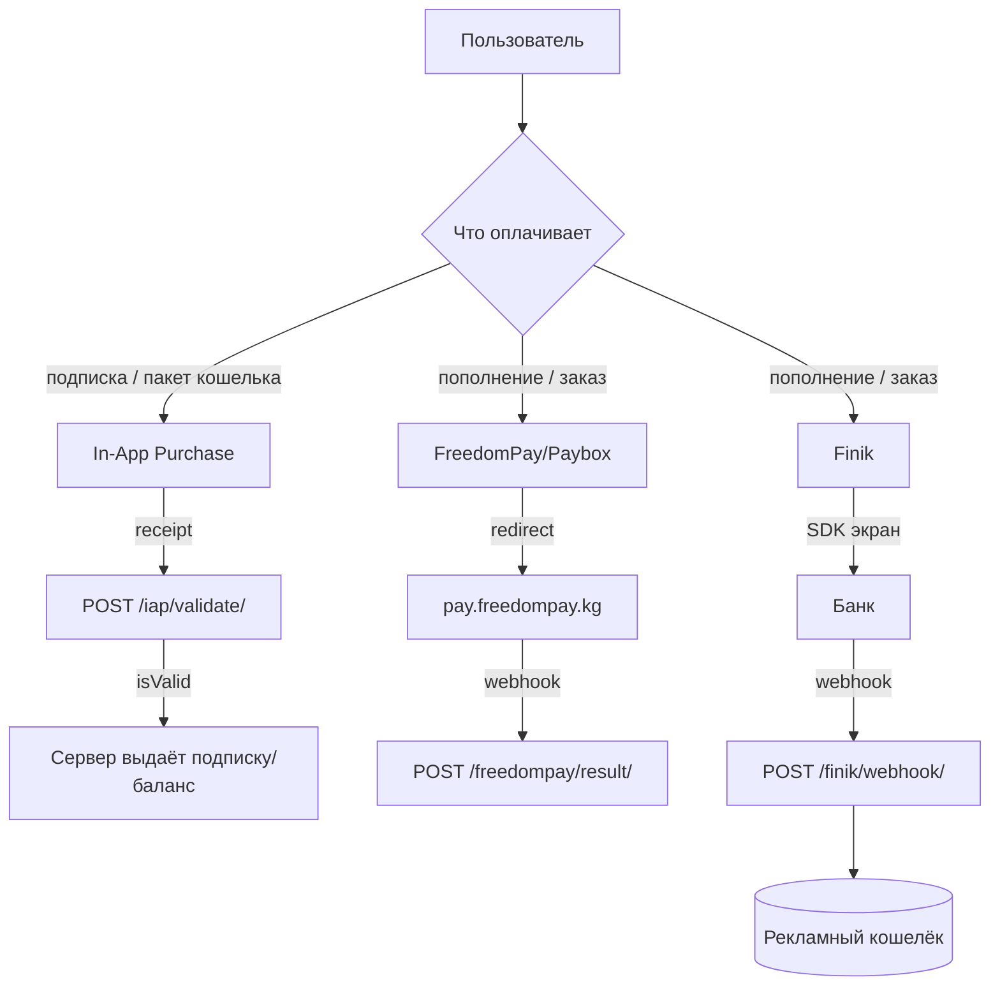

# Платежи

Три канала оплаты + рекламный кошелёк. Все секреты — в `/.env` (см.
[onboarding.md](../onboarding.md#содержимое-env)).



## 1. In-App Purchase (Apple / Google)

| Артефакт | Путь |
|---|---|
| Сервис | `lib/services/iap_service.dart` (`IAPService`, singleton) |
| Репозиторий | `lib/data/repositories/iap_repository.dart` (`IAPRepository`) |
| Инициализация | `IAPService().initialize()` в `_initializeDeferredServices` (main.dart) |

**Продукты:**
- Подписки: `business_weekly`, `business_monthly`.
- Пакеты кошелька: `ad_wallet_500`, `ad_wallet_1000`, `ad_wallet_2000`, `ad_wallet_5000`.

**Валидация (обязательно серверная):**
```
POST /iap/validate/
{ platform: "apple"|"google", receipt_data, subscription_id, package_name, transaction_id }
→ IAPValidationResult { isValid, data, error }
```
- `completePurchase()` вызывается **только после** успешной серверной валидации (требование Apple).
- iOS: `PaymentQueueDelegate` (`SKPaymentQueueDelegateWrapper`).
- ID продуктов меняются в `iap_service.dart` (+ App Store Connect / Play Console).

## 2. FreedomPay / Paybox

| Артефакт | Путь |
|---|---|
| Клиент | `lib/paybox/` (`PayboxClient`, пакет `flutter_paybox_2`) |
| Ключи `.env` | `MERCHANT_ID`, `SECRET_KEY`, `MERCHANT_CURRENCY` (def. KGS), `PAYBOX_TEST_MODE` |

- `createPayment({orderId, userId, amount, currencyCode, description, resultUrl, ...})`.
- Редирект: `ApiEndpoints.freedomPayRedirect(pmtId)` → `https://api.freedompay.kg/pay.html?customer=<pmtId>`.
- Вебхук: `ApiEndpoints.freedomPayWebhook` = `/freedompay/result/`.

## 3. Finik

| Артефакт | Путь |
|---|---|
| Экран | `lib/finik/` (`FinikPaymentScreen`, `@RoutePage`, пакет `finik_sdk`) |
| Ключи `.env` | `FINIK_API_KEY`, `FINIK_ACCOUNT_ID`, `FINIK_IS_BETA` |

- Параметры: orderId, amount, description, phone, userName, email, callbackUrl.
- Вебхук: `ApiEndpoints.finikWebhook` = `/finik/webhook/` — кредитует рекламный кошелёк (лаг от
  нескольких секунд до ~1 минуты; ранее была backend-проблема, исправлена).

## 4. Рекламный кошелёк (AdWallet)

| Артефакт | Путь |
|---|---|
| Сервис | `lib/services/wallet_payment_service.dart` (`WalletPaymentService`) |
| BLoC | `AdWalletBloc` (`lib/bloc/ad_wallet_bloc/`) |

- Пополнение: `POST /pay/up/` (provider `finik`/`freedompay`) или через IAP (`/pay/up/iap/`).
- Баланс используется для продвижения объявлений через `target/*` API
  (placement enum: `main/search/category_top/video_feed`).

## Связь с заказами

Локальные заказы (Hive) после успешной оплаты получают `OrderPaymentSuccessEvent` → помечаются
оплаченными. См. [features/cart-orders.md](cart-orders.md).
