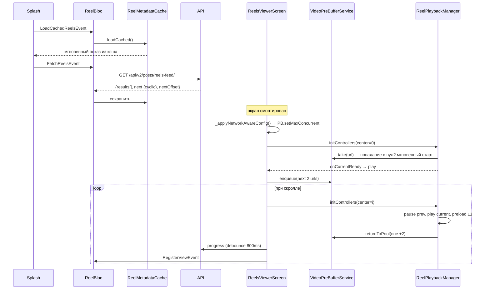
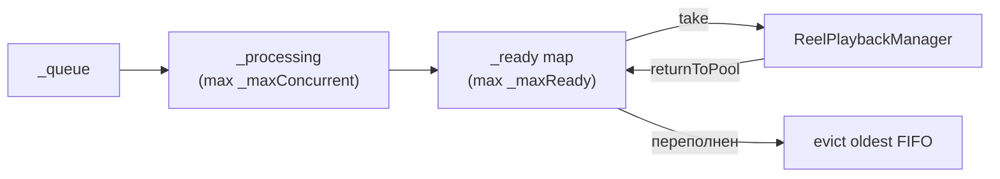

# Рилсы (видео-лента)

Вертикальная видео-лента в стиле TikTok: персонализированный цикличный фид, агрессивный
пребуферинг плееров и офлайн-доставка метрик.

## Компоненты

| Класс | Файл | Роль |
|---|---|---|
| `ReelBloc` | `lib/bloc/reel_bloc/` | состояние: загрузка, фильтр категории, лайки, просмотры, кэш |
| `ReelPlaybackManager` | `lib/pages/reels/reel_playback_manager.dart` | жизненный цикл плееров в окне ±2 вокруг текущего |
| `IVideoPreBufferService` → `VideoPreBufferService` | `lib/services/video_pre_buffer_service.dart` | пул готовых плееров (очередь → processing → ready), FIFO-вытеснение |
| `IPlayerFactory` | `lib/services/media_kit_player_factory.dart`, `lib/services/video_player_factory.dart` | фабрика плееров (см. ⚠️ ниже) |
| `IConnectivityConfig` → `ConnectivityAwareConfig` | `lib/services/connectivity_aware_config.dart` | конкуррентность пребуфера по типу сети |
| `IReelMetadataCache` → `ReelMetadataCache` | `lib/services/reel_metadata_cache.dart` | кэш фида в SharedPreferences (`cached_reel_metadata_v3`) |
| `ReelFeedActionQueue` | `lib/pages/reels/reel_feed_action_queue.dart` | офлайн-очередь прогресса/impression |

> ⚠️ **Две фабрики плееров.** В проекте есть `MediaKitPlayerFactory` (mpv, см. MEMORY) и
> `VideoPlayerFactory` (`video_player`). Идёт миграция (`main.dart` содержит
> `TODO(phase-2): remove MediaKit.ensureInitialized once ... migrate off media_kit`). Какая фабрика
> активна — определяется регистрацией `IPlayerFactory` в `lib/core/di/injection.dart`. **При работе
> с видео сначала проверьте, что именно зарегистрировано.** См.
> [troubleshooting.md](troubleshooting.md#два-видео-фактори).

## Поток данных

## Цикличный фид и пагинация

- Backend возвращает **цикличный `next`** (никогда null) — лента бесконечная.
- `ReelBloc._onFetchMoreReels` дедуплицирует по `id`: если встретился уже загруженный рил → этот и
  следующие = «конец уникального контента» → `hasReachedEnd = true`, сетевые запросы прекращаются.
- На клиенте `PageView` оборачивает индексы (`_wrap(index, len)`) — бесконечный скролл без повторных
  запросов.

## Пребуферинг и память

- `_maxReady`: iOS 4, Android 3 готовых плеера (контроль памяти, ~30 МБ на плеер).
- `_maxConcurrent` по сети (`ConnectivityAwareConfig`): fast(Wi-Fi)=3, mobile=2, slow/offline=1.
- Окно активных плееров: ±2 от текущего (макс 5). Вне окна — `returnToPool` (pause→seek(0)→volume 0),
  не dispose — для мгновенного реплея при обратном скролле.
- **Адаптивное торможение:** 3 ошибки подряд → пауза очереди (защита от UI-freeze на плохой сети).
- **Защита от быстрого скролла:** `_generation++` на каждый `initControllers`; устаревшая
  инициализация отменяется до завершения, плеер возвращается в пул.
- Таймаут первого кадра: пребуфер 5–6с, playback ~10с (1 ретрай через 1с).

## Lifecycle

- `paused` (фон): `pauseAll()`, `tracker.flush()` (отправить очередь), `flushForBackground()`
  (сбросить готовый пул) — минимизация памяти под OOM-killer.
- `resumed`: `initControllers(isActive=true)` с последнего индекса, `resume()` сбрасывает throttle.
- Прекэш обложек: первые ~10, декодирование разбито на 80мс-интервалы (не фризит слабые устройства).

## Офлайн-метрики (ReelFeedActionQueue)

- Виды: `progress`, `impression`. Дедуп по ключу `"${kind}:${postId}"`.
- Офлайн → копится в памяти; при возврате сети (`connectivity_plus` listener) → `_drain()`.
- Полный сброс очереди при сворачивании приложения.

## Ключевые виджеты

- `_ReelVideoPlayer` (StatefulWidget) — слои: обложка → видео (монтируется скрытым, fade-in после
  первого кадра) → debounced-спиннер буферизации (800мс).
- `_ReelRightActions` — лайк (оптимистично, `LikeReelEvent`/`UnlikeReelEvent`), комментарии, share.
- `_ReelFavoriteButton` — сохранение в «Сохранённые публикации» через `FavoriteBloc` (по `post.id`).
