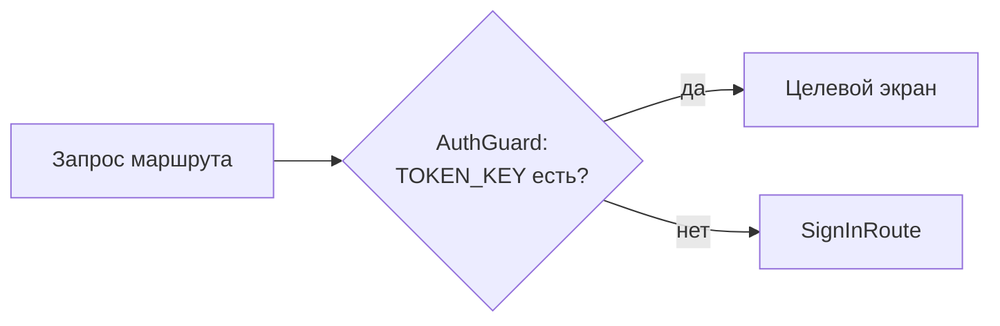

# Навигация (auto_route)

Навигация только через **auto_route** v10. Конфиг: `lib/app/router/app_router.dart` (**67
маршрутов**), сгенерированный part-файл `app_router.gr.dart`.

## Базовые правила

- Экран помечается `@RoutePage()`. Если у виджета нет суффикса `Screen`/`Page` — нужен явный
  `@RoutePage(name: 'XxxRoute')`, иначе конфликт имён.
- Переходы:
  ```dart
  context.router.push(SomeRoute());        // добавить в стек
  context.router.replaceAll([HomeRoute()]); // сбросить стек
  context.router.maybePop();                // назад
  ```
- Deep links: `_appRouter.push(SomeRoute())`.
- В диалогах/bottom sheets допускается `Navigator.pop` (намеренно, ~43 места).

## Guards

`AuthGuard` — первый guard проекта. Проверяет `TOKEN_KEY` в `SharedPreferences`; для защищённых
маршрутов (профиль другого пользователя, избранное и т.п.) при отсутствии токена редиректит на
`SignInRoute`.



## ⚠️ Важно про part-файл

`app_router.gr.dart` — это `part` от `app_router.dart`. Поэтому **все импорты моделей**, которые
используются в маршрутах (аргументы экранов), должны быть в `app_router.dart`, а не в `.gr.dart`.

## Как добавить экран
См. [how-to.md](how-to.md#добавить-экран).
